# COMP2521 - Data Structures and Algorithms

You may find the notes [here](https://www.notion.so/tymz/COMP2521-Data-Structures-and-Algorithms-708288ca10b541e5b21bd26a1179f52b) have better formatting. 
Link to practice material [here](./practice-material/index.md).

# Week 1: Algorithm Analysis

### Algorithm Analysis:

**Terminology:**

- *Empirical analysis —* involves implementing and running the algorithm and plotting a graph of time taken vs. input size
- *Theoretical analysis* — involves determining running time as a *function* of input size, *n*.
*independent of hardware and programming language (we can analyse *pseudocode* in terms of the number of *primitive operations* — maximised in the worst case)
- *Primitive operations* — accessing an array index, calling functions, evaluating expressions, etc.

### Big-O Notation (Time Complexity):

- Formal definition: if there exists positive constants *c* and *b* such that *f(n) ≤ cg(n)* holds for all *n > b*, then *f(n)* is *O(g(n))*

    

- It is true that *"2n is O(n²)"*, however we want the smallest class of functions, so we say *"2n is O(n)"*
- Big *O* — upper limit (worst case)   *f(n) ≤ cg(n)*
Big *Θ* — average range                  *f(n) ≥ cg(n)*
Big *Ω* — lower limit (best case)     *c'g(b) ≤ f(n) ≤ c''g(n)* 
The worst case time-complexity is generally the most important to discuss
- Polynomials: for *f(n)* with degree *d*, f(n) is *O(nᵈ)*
- For finding the worst case in recursive algorithms, we must understand the logic and work out how many steps are taken to reach the base case
- **Complexity classes:**
*N —* problems computable in polynomial time
*NP —* problems only computable in exponential time, so no P algorithm is known ("non-deterministic polynomial time on a theoretical *Turing Machine*")
*"tractable"* — has a polynomial-time algorithm 
*"intractable"* — only exponential-time algorithms are known  
*It has been proved that if some NP class problem can be solved in polynomial time, then ALL NP class problems become P problems
- ***Generate and test* algorithms:**
Useful when it is simple to generate new states and test whether they are a solution.
This guarantees we either find a solution, or prove none exist.
Eg. Checking primality by generating 2 to n-1 numbers and testing them
- Big-O is less about the exact number of operations and more about how the number changes with respect to problem size. A function with O(1) complexity (constant time) could take 0.000001 seconds to execute or two weeks to execute.

*Time-complexity for different operations on common data structures:*

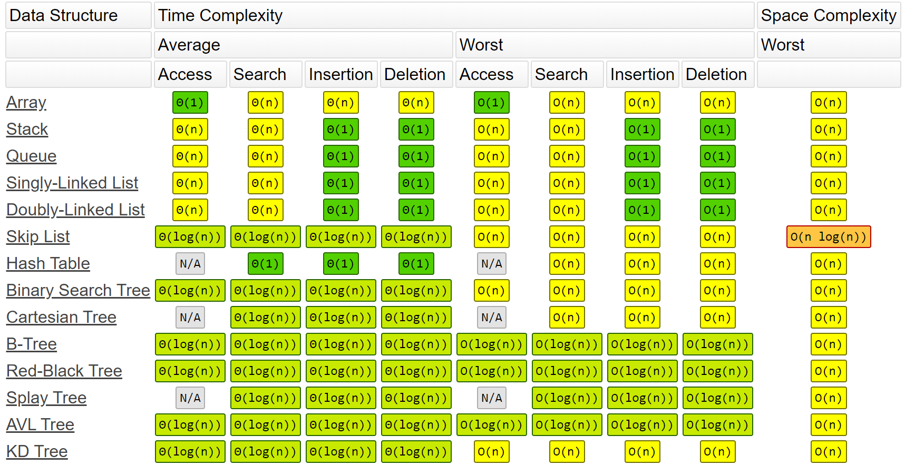

---

**Examples:**
O(1)

```c
void swap(int a[], int i, int j) {
		int tmp = a[i];  // O(1)
		a[i] = a[j];     // O(1)
		a[j] = tmp;      // O(1)
}                    // Total: O(1)
```

O(n)

```c
for (int i = 0; i < n; i++) {
		// Some O(1) statements
}   // Total: O(n)
```

O(n²)

```c
for (int i = 0; i < n; i++) {
		for (int j = 0; j < n; j++) {
				// Some O(1) statements
		}
}   // Total: O(n²), basically counting how many times the innermost statements get executed
```

O(logn)

```c
for (int i = 0; i < n; i *= 2) {
		// Some O(1) statements
}   // Total: O(log₂n)
// Eg. for n = 100, the loop will execute log₂(100) times, which is 6 or 7 times
```

# Week 2: Compilation and ADTs

### Abstract Data Types:

- **Abstract data type:** 
Abstract data types provide a separation between the interface and implementation. The interface only presents high-level functions that can be performed and their pre-conditions and post-conditions without us being concerned with how they are implemented. Users of the ADT see and use only the interface, so they are completely unaware of the underlying implementation of it.
- The interface (header file) provides just the function signatures/prototypes and a description of their semantics
- **Collections:**
Many ADTs are a collection of items, which might be simple types with an associated key.
    - Collections are categorised in terms of structure: *linear, branching, cyclic*, or in terms of usage: *set, matrix, stack, queue, search-tree, dictionary*
    - Typical functions: *create(), insert(), remove(), find(), display(),* etc.

---

**Set ADT example:**
A typical abstract **set** data type requires the following functions:

- `Set newSet()`
- `void freeSet(Set s)`
- `void displaySet(Set s)`
- `void setInsert(Set s, int data)`
- `void setRemove(Set s, int target)`
- `bool setIsMember(Set s, int target)`
- `Set setUnion(Set s, Set t)`
- `Set setIntersection(Set s, Set t)`
- `int setCardinality(Set s)`

ADTs are also expected to implement error-handling to check that things like pre-conditions, post-conditions and whether or not the input is valid value.

*Time-complexities for a set implementation using various underlying data structures:*

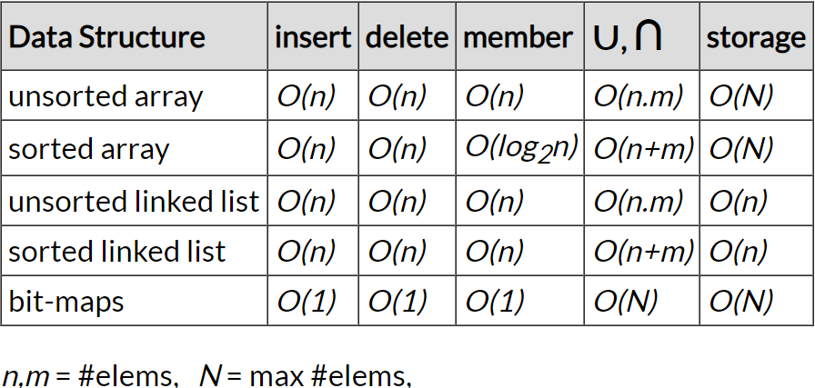

As the person implementing an abstract data type for other uses, after you decide what functions you want to supply, you go through each possible implementation and compare the set of time-complexities for each implementation and then pick the appropriate implementation based on which functions are most important to the specifications. 

---

# Week 3: Trees I

### Tree Data Structures:

- Trees — connected graphs with no cycles where any two nodes are connected by exactly one unique path. Each node holds data and has links to child nodes
- Binary trees — recursive definition: "a binary tree is a tree that is either empty, or consists of a node with two binary subtrees"
    - Binary search trees — every node is the *root* of 0-2 *subtrees,* where the left subtree contains all values lower than the root value and right subtree contains all values greater than the root value
- Balanced tree — has *minimal* height possible for the given number of nodes (for n nodes, the height is *log(n)*)
    - Perfectly balanced tree —  when the difference between the number of nodes in the subtrees of *every node* is no more than 1
    `abs(countNodes(t → left), countNodes(t → right)) ≤ 1`
- Degenerate tree — has *maximal* height possible for the given number of nodes (linear structure)

*Tree structure:*

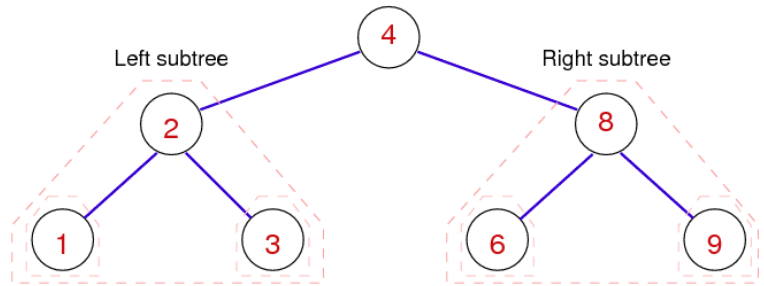

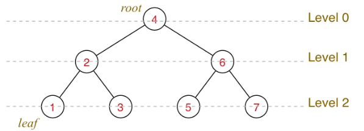

*Tree 'indexes':*

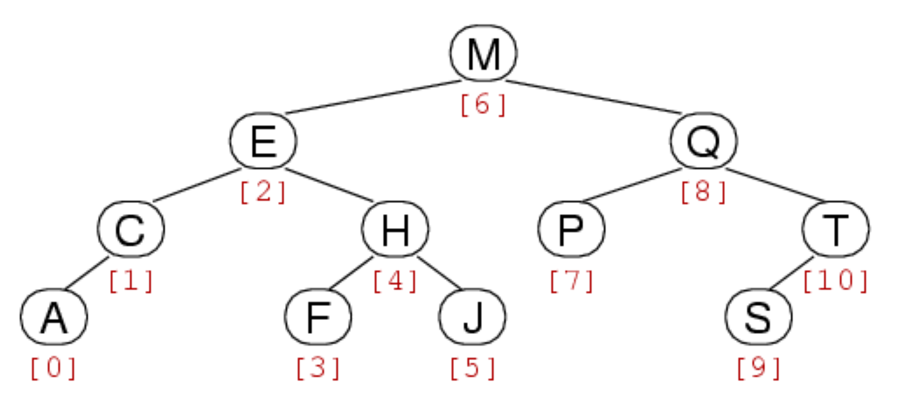

### Binary Search-Trees:

- The time-complexity for tree algorithms is typically *O(height of tree),* and for a *balanced* binary search tree, *height = log(n)*.
- Example: consider the *balanced binary search tree* corresponding to the sorted array: [2, 5, 10, 12, 14, 17, **20**, 24, 29, 30, 31, 32]
    - All child nodes to the left are less than the parent, all child nodes to the right are greater than the parent.-
    - Every node has *at most 2 child nodes*
    - If the target value isn't found in the tree, then it is inserted where it was failed to be found.
- The structure of the tree depends on the order of insertion of the elements
- Each node contains a pointer to the root node of its left subtree and a pointer to the root node of its right subtree

*Possible struct declaration:*

```c
typedef struct BSTNode *Tree;
struct BSTNode {  
		int data;
		BSTNode *left;
		BSTNode *right;   // We could add more fields like: int numNodes, which counts how many nodes are under this node
};
```

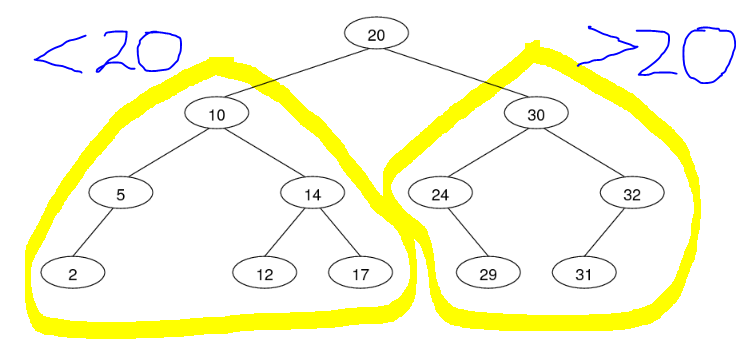

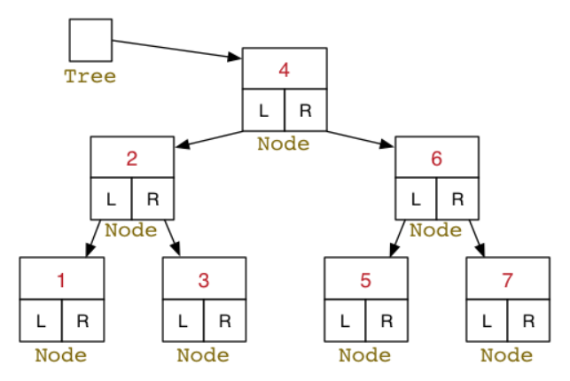

---

### **Tree Algorithms:**

### **Tree traversal:**

- **Preorder NLR** — root → left subtree → right subtree

    ```c
    void printPreorder(BSTree t) {
    		if (t == NULL) return;
    		printf("%d ", t -> value);
    		printPreorder(t -> left);
    		printPreorder(t -> right);
    }
    ```

    *Iterative alternative, using a stack*

    ```c
    void printPreorder(BSTree t) {
    		Stack stack= StackNew();   // Stack contains BSTree nodes
    		StackPush(stack, t);
    		while (StackSize(s) > 0) {
    				BSTree curr = StackPop(stack);
    				printf("%d ", curr -> value);
    				if (curr -> right != NULL) StackPush(curr -> right);
    				if (curr -> left != NULL) StackPush(curr -> left);
    		}
    		StackFree(stack);
    }
    ```

- **Inorder LNR** **— left subtree → then root → then right subtree

    ```c
    void printInorder(BSTree t) {
    		if (t == NULL) return;
    		printInorder(t -> left);
    		printf("%d ", t -> value);
    		printInorder(t -> right);
    }
    ```

- **Postorder LRN** **— left subtree → right subtree → then root

    ```c
    void printPostorder(BSTree t) {
    		if (t == NULL) return;
    		printPostorder(t -> left);
    		printPostorder(t -> right);
    		printf("%d ", t -> value);
    }
    ```

- **Level-order** **— root → all its children from left to right → then their children from left to rightand so on

    ```c
    void printLevelOrder(BSTree t) {
    		Queue q = QueueNew();   // Stack contains BSTree nodes
    		QueueEnqueue(q, t);
    		while (QueueSize(s) > 0) {
    				BSTree curr = QueueDequeue(q);
    				printf("%d ", curr -> value);
    				if (curr -> left != NULL) QueueEnqueue(curr -> left);
    				if (curr -> right != NULL) QueueEnqueue(curr -> right);
    		}
    		QueueFree(q);
    }
    ```

### T**ree Properties:**

- **Searching for node:**

    ```c
    bool BSTSearch(BSTree t, int target) {
    		if (t == NULL) return false;
    		if (t -> value == target) {      // Target has been reached
    				return true;
    		}
    		else if (target < t -> value) {  // Go search for the target in the left subtree
    				return BSTSearch(t -> left, target);
    		}
    		else if (target > t -> value) {  // Go search for the target in the right subtree
    				return BSTSearch(t -> right, target);
    		}
    }
    ```

- **Counting nodes:**

    ```c
    int count(Tree t) {
    		return t == NULL ? 0 : 1 + count(t -> left) + count(t -> right);
    }
    ```

- **Getting the height:**

    ```c
    int TreeHeight(Tree t) {
        if (t == NULL) return 0;
        if (t -> left == NULL && t -> right == NULL) return 0;       // Do I need this?
        if (t -> left == NULL && t -> right != NULL) return 1 + TreeHeight(t -> right);
        if (t -> right == NULL && t -> left != NULL) return 1 + TreeHeight(t -> left);
        return 1 + max(TreeHeight(t -> left), TreeHeight(t -> right));
    }
    ```

### **Tree Maintenance:**

- **Merging two trees:**
*Pre-condition:* takes 2 trees, `t1` and `t2`
*Post-condition:* ordered binary search-tree with all items in `t1` and `t2`
1. Find min node in `t2`: keep going left until NULL. We are guaranteed that this min node will have no left subtree
2. Set this min node to be the main root node of the resultant tree
3. Set the right subtree of the min node (if it exists) as the left subtree of the root node of `t2`
4. Set `t1` as the left subtree of the min node
Return min node (which is the new root)

    

```c
Tree JoinTree(Tree t1, Tree t2) {
		if (t1 == NULL) return t2;
		if (t2 == NULL) return t1;
		Tree minNode = t2; 		
		Tree minNodeParent = NULL;
		while (minNode -> left != NULL) {  // Find the minimum node of t2
				minNodeParent = minNode;
				minNode = minNode -> left;
		}
		if (minNodeParent != NULL) {
				minNodeParent -> left = minNode -> right;
				minNode -> right = t2;
		}
		minNode -> left = t1;
}
```

- **Right rotation:**
Moves the left child to root, assigning the original root as the left child's right subtree

    ```c
    BSTree rotateR(BSTree t) {         // Shifts root node right-down and the pivot node right-up
    		if (t == NULL) return NULL;       
    		BSTree pivot = t -> left;
    		if (pivot == NULL) return t;   // If t has no left component, then we can't do a meaningful right rotation
    		t -> left = pivot -> right;    // Assign the pivots right subtree to be the left subtree of the previous root
    		pivot -> right = t;            // Assign the previous root to be the right child of the pivot
    		return pivot;                  // Pivot is the new root
    }
    ```

- **Left rotation:**
Moves the right child to root, assigning the original root as the right child's left subtree

    ```c
    BSTree rotateR(BSTree t) {         // Shifts root node left-down and the pivot node left-up
    		if (t == NULL) return NULL;       
    		BSTree pivot = t -> right;
    		if (pivot == NULL) return t;   // If t has no right element, then the left rotation does nothing
    		t -> right = pivot -> left;    // Assign the pivots left subtree to be the right subtree of the previous root
    		pivot -> left = t;             // Assign the previous root to be the left child of the pivot
    		return pivot;                  // Pivot is the new root
    }
    ```

- **Inserting at leaf:**
Insertion algorithm terminates when current node is NULL, which means we have reached a suitable leaf position

    ```c
    BSTree BSTreeInsert(BSTree t, int val) {
    		if (t == NULL) {                        // Reached leaf node (terminating case)
    				BSTree newLeaf = malloc(sizeof(struct BSTNode));
    				newLeaf -> value = val;
    				newLeaf -> left = NULL;
    				newLeaf -> right = NULL;
    				return newLeaf;
    		} 
    		if (t -> value == val) return t;        // Tree already contains the value. Just return

    		if (val < t -> value) {                 // Go insert in the left subtree
    				t -> left = BSTreeInsert(t -> left, val);
    		} else if (val > t -> value) {        	// Go insert in the right subtree
    				t -> right = BSTreeInsert(t -> right, val);
    		} 
    		return t;
    }
    ```

- **Inserting at root:**
Like insertion at the leaf but requires rearrangement of the tree for each insert. Recent entries are close to the root so retrieving these are quicker than if we were to insert at the leaf everytime. 
1. Insert new node as leaf
2. Lift the new node to the root by a series of rotations

    ```c
    BSTree BSTreeInsert(BSTree t, int val) {
    		if (t == NULL) {
    				BSTree newLeaf = malloc(sizeof(struct BSTNode));
    				newLeaf -> value = val;
    				newLeaf -> left = NULL;
    				newLeaf -> right = NULL;
    				return newLeaf;
    		}
    		if (val < t -> value) {
    				t -> left = BSTreeInsert(t -> left, val); 
    				return rotateRight(t);
    		}
    		else if (val > t -> value) {
    				t -> right = BSTreeInsert(t -> right, val);
    				return rotateLeft(t);
    		}
        // If the execution reaches here, the value probably already exists in the tree. Do nothing
    		return t;
    }
    ```

    Time-complexity: *O(height)*

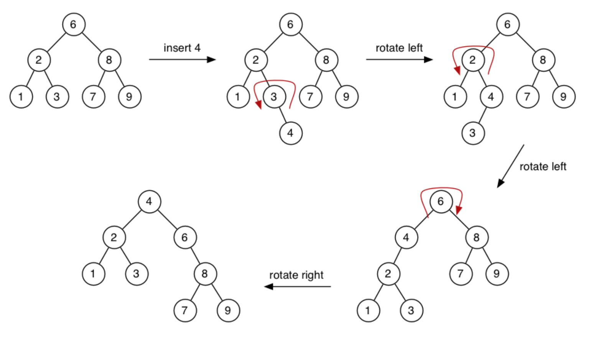

- **Deleting a node:**
Do a regular search for the target node and then handle deletion by cases once reached: 
1. Target has no subtrees — simple deletion
2. Target has 1 subtree — replace target with its child
3. Target has 2 subtrees — call mergeTrees to merge the target's children to replace the deleted target
4. Target doesn't exist — do nothing and return

    ```c
    Tree deleteNode(Tree t, int target) {
    		if (t != NULL) {
    				if (t -> value > target) {        // Target is somewhere in the left subtree
    						deleteNode(t -> left, target);
    				}
    				else if (t -> value < target) {   // Target is somewhere in the right subtree
    						deleteNode(t -> right, target);
    				}
    				else if (t -> value == target) {  // Reached the target node
    						if (t -> left != NULL && t -> right != NULL) {  // Both subtrees exist
    								Tree t1 = t -> left;
    								Tree t2 = t -> right;
    								free(t);
    								return mergeTree(t -> left, t -> right);
    						}
    						else if (t -> left != NULL) {   // Only the left subtree exists
    								Tree ret = t -> left;
    								free(t);
    								return ret;
    						}
    						else if (t -> right != NULL) {  // Only the right subtree exists
    								Tree ret = t -> right;
    								free(t);
    								return ret;
    						} 
    						else {  // No subtrees. Simple deletion
    								free(t);		
    								return NULL;						
    						}
    				}
    		}
    		return t;
    }
    ```

- **Rebalancing:** 
Logic to rebalance any BST: 
1. Set the *median node as the new root* using the `partition()` function
2. Recurse through each subtree, setting the *median node as the new root* for every single node

    Time-complexity of rebalancing is *O(N)* because each node is visited
    We can choose to rebalance periodically (eg. after every 20 insertions), or whenever the tree's imbalance exceeds a threshold

    ```c
    Tree Rebalance(Tree t) {
    		if (countNodes(t) >= 3) {
    				Tree newRoot = Partition(t, n / 2);  // Sets the node at index n/2 (the median node) as the new root
    				t -> left = Rebalance(t -> left);    // Rebalance both subtrees
    				t -> right = Rebalance(t -> right);
    		}
    		return t;
    }
    ```

- **Partition:**
Sets the node at a *chosen index* to be the new root (using a sequence of tree rotations to lift the node at the chosen index up to the root). 
1. Count the nodes in the left subtree, if it is equal to the target index, then the current node is the one we were after — just return t
2. If the index is greater than the number of nodes in the left subtree, then we know that the target node is somewhere in the

    ```c
    Tree Partition(Tree t, int newRootIndex) {
    		int leftNumNodes = countNodes(t -> left);
    		if (leftNumNodes > newRootIndex) {       // The rootIndex is somewhere in the left subtree
    				t -> left = Partition(t -> left, newRootIndex);		
    				t = rotateRight(t);    // Rotate right, to lift the new median node up to root
    		}
    		else if (leftNumNodes < newRootIndex) {  // The rootIndex is somewhere in the right subtree 
    				t -> right = Partition(t -> right, newRootIndex - leftNumNodes - 1);
    				t = rotateLeft(t);     // Rotate left, to lift the new median node up to root
    		}
    		return t;
    }
    ```

---

# Week 4: Trees II — Specialised Search Trees

- The BST shape depends on the order of insertion. 
The best case is that the values are inserted in preorder, so median value first, then the median of the left half, then the median of the right half, and so on
The worst case is that the values are inserted in order or reverse order, forming a degenerate tree
- Randomised trees makes worst case performance unlikely
- Splay-trees, randomised trees and occasional rebalance trees have worst case of O(N), but ideally, we want *O(log(n)).*
AVL trees fix imbalances as they arise, therefore maintaining a height of log(n). Repairs are done locally and not on the overall tree
2-3-4 trees use varying-sized nodes to assist balance

### **Splay Trees:**

- Like BST but new entries are always inserted at the root and searched entries are always brought up to the root (this is called "splaying"). This behaviour models caching, which means recently interacted with nodes are quicker to retrieve
    - The insert for splay trees modifies the standard `insertAtRoot()` function. Considers parent-child-grandchildren links and performs a sequence of rotations depending on the orientation of parent to child to grandchildren. This tends to improve tree balance more than the standard `insertAtRoot()` function
- Amortised cost — allows very quick retrieval of recent nodes but at the cost of a slower insertion and search strategy, but splaying also tends to improve the balance of the tree
Search operations are still O(n) since the tree is explicitly maintaining balance.

Target node belongs somewhere in the grandchildren subtrees — zig-zig and zig-zag cases: 

1. Target node is in the left child's left child — zig-zig:      `rotateRight(t)` twice
2. Target node is in the left child's right child — zig-zag:   `rotateLeft(t → left)` then `rotateRight(t)`
3. Target node is in the right child's left child — zig-zag:   `rotateRight(t → right)` then `rotateLeft(t)`
4. Target node is in the right child's right child — zig-zig: `rotateLeft(t)` twice

If the target node belongs in the left 

```c
// Lifts a target node to the root by a sequence of rotations depending on cases
struct node *splay(struct node *root, int target) { 
    if (root == NULL || root->key == key) return root;   // Terminating case: either root is NULL root contains key
    
		// Target is somewhere in left subtree  
		if (root -> value > target) {  
        if (root -> left == NULL) return root;                     // Target must be in the left child, but there is no left child, so the key must not exist

				// Dealing with zig-zig and zig-zag:
        if (root -> left -> value > target) {                      // Target must belong somewhere in the left child's left child - Zig-Zig
            root -> left -> left = splay(root -> left -> left, key);   // This call to splay recursively lifts the target node to become the root of the left-left node
            root = rightRotate(root);                              // Do FIRST rotation on the parent node
        } 
        else if (root -> left -> value < target) {                 // Target must be somewhere in the left child's right child
            root -> left -> right = splay(root -> left -> right, target);  // This call to splay recursively lifts the target node to become the root of the left-left node
            if (root -> left -> right != NULL)                     // If the the left child's right child exists, then call rotateLeft on the left child
                root -> left = leftRotate(root -> left); 
        } 
        return (root -> left == NULL) ? root: rightRotate(root);   // Do SECOND rotation, only if the right subtree exists
    } 

		// Target is somewhere in the right subtree
    else {  
        if (root -> right == NULL) return root;                    // Right subtree doesn't exist so the target doesn't either
				// Dealing with zig-zig and zig-zag:
        if (root -> right -> value > target) { 
            root -> right -> left = splay(root -> right -> left, target);     // Lifts the target to the root of the right child's left subtree 
            if (root -> right -> left != NULL) 
                root -> right = rightRotate(root -> right); 
        } 
        else if (root -> right -> value < target) { 
            root -> right -> right = splay(root -> right -> right, target);   // Bring the key as root of right-right and do first rotation 
            root = leftRotate(root); 
        } 
        return (root->right == NULL)? root: leftRotate(root);      // Do second rotation for root
    } 
}
```

Time-complexity: O(n) — but a better average case usually

### AVL-Trees:

- AVL trees fix imbalances as soon as they occur by checking the height of left and right subtrees in its insertion function `AVLInsert()`. An imbalance is when `abs(leftSubtreeHeight - rightSubtreeHeight) > 1`
- The maximum height difference between *any node's subtrees* is 2, since the precondition is that we are given an AVL height balanced tree
- Getting the height of a tree may be expensive, so AVL trees tend to have poorer performance for insertion operations as a tradeoff for a *O(logn)* search function. 
It may help to augment the struct declaration with more fields that keeps track of height differences, for example.

```c
Tree AVLInsert(Tree t, int val) {        // Expects the input tree to not have any existing imbalances
		if (t == NULL) return newTree(val);  // This is where insertion occurs
		if (t -> value == val) return t;     // Attempting insert a value that already exists in the tree
		
		if (t -> value > val) {
				t -> left = AVLInsert(t -> left, val);				
		}
		else if (t -> value < val) {
				t -> right = AVLInsert(t -> right, val);
		}
		// After insertion, get the heights and check if a new imbalance needs to be fixed
		int leftHeight = getHeight(t -> left);
		int rightHeight = getHeight(t -> right);
		if (leftHeight - rightHeight > 1) {  // This means the left subtree is exactly 2 nodes deep (imbalances can only ever be a 2 node difference because we have a balanced tree to begin with)
				if (val > (t -> left -> data)) {
						t -> left = rotateLeft(t -> left);
						t = rotateRight(t);
				} else {
						t = rotateRight(t);
				}
		}
		else if (rightHeight - leftheight > 1) {  // Right subtree has 2 nodes more than the left
				if (val < (t -> right -> data)) {
						t -> right = rotateRight(t -> right);
						t = rotateLeft(t);
				} else {
						t = rotateLeft(t);
				}
		}
		return t;		
}
```


### 2-3-4 Trees:

2-3-4 trees have special nodes:

- 1-value node: can have 2 subtrees
- 2-value node: can have 3 subtrees
- 3-value node: can have 4 subtrees

In 2-3-4 trees, *all leaves are equidistant from the root,* meaning all leaves are on the same bottom level. The insertion function for 2-3-4 trees will always maintain height balance


*2-3-4 Search:*

```c
Tree Search234(Tree t, int item) {
		if (t == NULL) return t;
		int slotIndex = 0;
		while (slotIndex < (t -> type- 1) && item > t -> nodeValues[slotIndex) {
				// Keep iterating until either we've reached the end of the current node's values or if we've bumped into a value greater than the one we want
				slotIndex++;  
		}
		if (item == t -> nodeValues[slotIndex]) {
				return t;  // Item was found in the current node
		} else {
				return Search234(t -> children[slotIndex], item)  // Item was not found in the current node and so must be somewhere in the child at slotIndex
		}
}
```

*Time-complexity*:

- Worst case: all nodes are 2-nodes, so O(log2(n)). Remember, 2-3-4 trees are always height balanced
- Best case: all nodes are 4-nodes, so O(log4(n))

*Possible struct declaration*

```c
struct treeNode {
		int type;                      // Can take the values: 2, 3 or 4
		int nodeValues[3];             // Items held in the node (a 4 node holds a maximum of 3 values)
		struct treeNode *children[4];  // Array of pointers to children treeNodes
};
```

***234Insert***

1. Find where to insert using Search()
2. If not full, insert into the node's `nodeValues[ ]` and promote its type, `type++`
3. If full: 
    - Push the middle node `nodeValues[1]` into the parent's `nodeValues` array, then split into two 2-nodes, storing nodeValues[0] and nodeValues[1] and inserting the new entry into the correct 2-node
        - If the parent is also full, then the parent must be split as well by the same process
        - If the root node is full, then it must be split by the same process but create a new 2-node as the new root

*2-3-4 Insertion 
Just watch the visualisation (implementation out of the scope of this course): [https://people.ok.ubc.ca/ylucet/DS/BTree.html](https://people.ok.ubc.ca/ylucet/DS/BTree.html)):*

```c
Tree Insert234(Tree t, int item) {
		if (t == NULL) return newTree(item);
		Tree insertionNode = Search234(t, item);
		Tree parentNode = parent of insertionNode;  // Parent of insertionNode

		if (insertionNode -> type < 4) {  // Node is not full
				insertionNode -> type++;      // Insert into ordered array
		}
		else {  // Node is full
				int promoteVal = insertionNode -> nodeValues[1];
				Tree newLeaf1 = newTree(insertionNode -> nodeValues[0]);
				Tree newLeaf2 = newTree(insertionNode -> nodeValues[2]);
				if (item < newLeaf1) {        // Insert in the left leaf fragment
						Insert234(newLeaf1, item);
				}
				else {  // Otherwise insert in the right leaf fragment
						Insert234(newLeaf2, item); 
				}
				if (parentNode == t) {        // If the parent is the root, then split the root by the same process and 
						
				}
				Insert234(parentNode, promoteVal);
				while(parentNode -> order == 4) {
						continue promoting nodes up
				}
				if (parentNode == root of tree && parent -> order == 4) {
						split root, malloc a new node and set that as the new root of the entire tree
				}
		}
}
```

# Week 5: Graphs I

### Graph Data Structures

A graph is a set of Vertices *V* and a set of edges *E* (a subset of the Cartesian product *V × V*)

**Graph Theory basics:**

- A graph with *V* vertices has at most *V(V-1)/2* edges
- A graph is *dense* if |E| is closer to V²
A graph is *sparse* if |E| is closer to V
- Connected vertices are called *adjacent*. The edge between them is *incident* on them
- **Degree:** number of edges *incident* on a vertex
- **Walk:** a sequence of vertices to travel from one vertex to another
- **Path:** a *walk* with no repeated vertices (hence no repeated edges)
    - **Euler path:** a *path* that includes *all edges exactly once*, possibly revisiting used vertices
    - **Hamiltonian path:** a *path* that includes *all vertices exactly once*, possibly revisiting used edges
- **Circuit:** a *path* that ends on the same vertex
    - **Euler circuit:** a *circuit* including *all edges exactly once*, possibly revisiting used vertices
    - **Hamiltonian circuit:** a *circuit* including *all vertices exactly once*, possibly revisiting used edges

**Graph Types:**

- **Connected graph:** there exists a *path between any two vertices*
- **Complete graph:** **there is an edge from every vertex to every other vertex (|E| = V(V-1)/2, which is the maximal amount of edges a graph can have)
- **Tree:** *connected subgraph* of the graph containing no possible *circuits*
    - **Spanning tree:** a *tree* containing every vertex in the original graph
        - **Minimum spanning tree:** a *spanning tree* where the sum of all weights is minimised.
        - **Shortest path spanning tree:** a spanning tree where the weighted paths from a source vertex to every other vertex is minimised
- **Clique:** a *complete graph* which is a *subgraph* of the original graph
- **Undirected graph:** any graph with only bidirectional relations
- **Directed graph:** any graph with unidirectional relations
- **Weighted graph:** any graph where edges have an associated value (weight)
- **Multi-graph:** any graph that contains parallel edges between vertices

*Possible struct declaration:*

```c
struct graphRep {
		int numNodes;
		int numEdges;     
		int **edgeMatrix;  // Using an adjacency matrix to store all connections. We could alternatively use an array of edges or an adjacency list
};
```

**Graph Data Structures:**
A graph is representable as an: *array of edges*, *adjacency matrix* and *adjacency list*. These representations each provide sufficient information to reconstruct the same graph diagrammatically. The choice of which underlying data structure to use for a graph ADT depends on which operations we want to optimise the most.

**Array of edges:**
`{(v1, w1), ..., (vn, wn)}` — array of 2-tuples. Could also use 3-tuples to store the weight of the edge.
Vertex tuples are *ordered* for directed graphs, to encode direction. In undirected graphs, `(1, 2)` is equivalent to `(2, 1)`

*Time-complexities of functions:*

- Initialisating a new graph: O(1)
- Insertion: O(E) — loop through until the end to check the edge doesn't already exist
- Deletion: O(E) — loop through, delete target, then shift all elements thereafter down by 1 index

Note: if we maintain an ordered array of edges, then the time complexity of insertion and deletion can be reduced to O(log(E)) with a binary search algorithm

*Space-complexity:* O(E)

**Adjacency matrix:**
*`V × V`* matrix — where each coordinate in the matrix correspondeds to an edge's existence (and its weight, conveniently).
Undirected graphs have a symmetric matrix while directed graphs usually have a non-symmetric matrix

*Time-complexities of functions:*

- Initialisating a new graph: O(V²) — for setting all coordinates to 0
- Insertion: O(1) — assign a new value to a coordinate
- Deletion: O(1) — reset a coordinate to 0

*Space-complexity:* O(V²)

**Adjacency list:**
Array of linked list heads — for each vertex, store a linked list of its neighbour vertices.

*Time-complexities of functions:*

- Initialisating a new graph: O(V) — Initialise all linked list heads to `NULL`
- Insertion: O(1) — access index and insert the vertex value into the linked list
- Deletion: O(E) — search for the target value in the list

*Space-complexity:* O(V+E) — O(V) for the array size, O(E) for the size of the all the linked lists attached to each array index

### Graph **Algorithms:**

### Graph Traversal:

Two traversal methods are depth-first search and breadth-first search. Both use a `bool visited[]` array to prevent the algorithm from returning to an already visited node

**Depth-First Search:** 
Follows one single path to completion and then considers other paths one step back and so on.
Can be implemented recursively or iteratively (using a stack structure)

*A skeleton for a recursive DFS algorithm:*

```c
// Expects all elements of the visited array to be intialised to false
void DepthFirstSearch(Graph g, int start, bool visited[]) {
		visited[start] = true;
		for (int i = 0; i < g -> numVertices; i++) {
				if (isAdjacent(start, i) && visited[i] == false) {
						depthFirstSearch(g, i, visited);
				}
		}
}
// Could modify this function to do things like: 
// - print all elements
// - return a bool if a path exists from src to dest, etc.
// - pass a int pred[] array to track predecessor nodes (which lets us then trace and print paths from src to dest)
```

Time-complexity: O(V+E) — each vertex is accessed, and possibly every edge

*Iterative DFS using a stack ADT:*

```c
void DepthFirstSearch(Graph g, int src) {
		bool visited[g -> numVertices];
		for (int i = 0; i < g -> numVertices; i++) visited[i] = false;
		Stack s = newStack();
		StackPush(s, src);
		while (StackSize(s) > 0) {
				int curr = StackPop(s);
				visited[curr] = true;
				for (int i = 0; i < g -> numVertices; i++) {
						if (isAdjacent(g, curr, i) && visited[i] == false) {
								StackPush(s, i);
						}
				}
		}
		StackFree(s);
}
```

**Breadth-First Search:**
Spreads outwards, like a level-order traversal, only considering adjacent vertices. 

*A skeleton for iterative BFS: (basically iterative DFS but with a queue ADT)*

```c
void BreadthFirstSearch(Graph g, int src, bool visited[]) {
		bool visited[g -> numVertices];
		for (int i = 0; i < g -> numVertices; i++) visited[i] = false;
		Queue q = QueueNew();
		QueueEnqueue(q, src);
		while (QueueSize(q) > 0) {
				int curr = QueueDequeue(q);
				visited[curr] = true;
				for (int i = 0; i < g -> numVertices; i++) {
						if (isAdjacent(g, curr, i) && visited[i] == false) {
								QueueEnqueue(q, i);
						}
				}
		}
		QueueFree(q);
}
// Could use this function for:
// - tracing paths (using an int pred[] array)
// - finding the shortest path (fewest edges) from a source to a destination 
```

Time-complexity: O(V+E) — each vertex is visited, and possibly every edge

---

### Graph Properties:

**Finding all connected subgraphs:**
`numConnected()` returns the number of connected subgraphs the given graph has

```c
int numConnected(Graph g) {
    int subgraphID[GraphNumVertices(g)];
    for (int i = 0; i < GraphNumVertices(g); i++) subgraphID[i] = -1;
    int numConnected = 0;
    for (int i = 0; i < GraphNumVertices(g); i++) {
        if (subgraphID[i] == -1) {  // The current vertex hasn't been marked as belonging to a connected subgraph
            dfsSetConnected(g, i, numConnected, subgraphID);
            numConnected++;
        }
    }
    return numConnected;
}

// Goes through every reachable vertex and marks them with an ID
void dfsSetConnected(Graph g, int start, int id, int subgraphID[]) {
    subgraphID[start] = id;
    for (int i = 0; i < GraphNumVertices(g); i++) {
        if (GraphIsAdjacent(g, start, i) && subgraphID[i] == -1) {
            dfsSetConnected(g, i, id, subgraphID);
        }
    }
}
```

**Determining reachability:**
Checks if a `dest` vertex is reachable from a `src` vertex:

```c
bool reachableDFS(Graph g, int src, int dest, bool visited[]) {
    if (src == dest) return true;  // Reached destination from some DFS path from src
    for (int i = 0; i < GraphNumVertices(g); i++) {
        if (GraphIsAdjacent(g, src, i) && visited[i] == false) {
            visited[i] = true;
            if (reachableDFS(g, i, dest, visited)) {
                return true;
            }
        }
    }
    return false;
}
```

**Eulerian Paths:**
A path containing every edge exactly once. Allowed to visit vertices more than once

Could implement a brute force algorithm, but we know some important theorems:
*Theorem*. A graph has an *Euler circuit* iff it is connected with all vertices of even degree
*Theorem.* A graph has an *Euler path* iff it is connected and exactly two vertices are of odd degree

```c
// Assumes src != dest
bool hasEulerianPath(Graph g, int src, int dest) {
    if (numConnectedSubgraphs(g) > 1) return false;  // Graph must be connected for an Euler path to exist
    if (degree(g, src) % 2 == 1 && degree(g, dest) % 2 == 1) {
        for (int i = 0; i < GraphNumVertices(g); i++) {
            if (i != src && i != dest) {
                if (degree(g, i) % 2 == 1) {
                    return false;  // Return false since there exists some vertex with odd degree which is not the start or dest vertex 
                }
            }
        }
        return true;   
    }
    return false;
}
```

*Time-complexity:* O(V) — to check if all other vertices are of odd degree. This becomes O(V²) if getting the degree of a vertex requires looping

**Hamiltonian Paths (brute force generate-and-test):**
Requires brute force algorithm (no simpler algorithm known):  

1. Generate all simple paths from v to w (using dfs for example), 
2. Keep a counter of number of vertices visited for the current path,
3. Successful path has been found if this counter is equal to the total number of vertices. Otherwise unsuccessful if all simple paths have been exhausted

```c
bool hasHamiltonianPath(Graph g, int src, int dest) {
    bool visited[GraphNumVertices(g)];
    for (int i = 0; i < GraphNumVertices(g); i++) visited[i] = false;
    return hamiltonR(g, src, dest, GraphNumVertices(g) - 1, visited);
}

bool hamiltonR(Graph g, int src, int dest, int dist, bool visited[]) {
    if (src == dest) {
        if (dist == 0) return true;
        else return false;
    }    
    else {
        visited[src] = true;
        for (int i = 0; i < GraphNumVertices(g); i++) {
            if (GraphIsAdjacent(g, src, i) && visited[i] == false) {
                if (hamiltonR(g, i, dest, dist - 1, visited)) {
                    return true;
                }
            }
        }
    }
    visited[src] = false;  // Set this vertex back to false, so we don't avoid using it in the generation of other possible paths
    return false;   
}
```

*Time-complexity:* O((V-1)!) — since there could be (V-1)! paths to examine

# Week 6: Graphs II

### More on Graph Representation:

### Directed Graphs:

Directed graphs can be represented with the same basic data structures, like an:
- Adjacency matrix — which is not necessarily symmetrical
- Adjacency list
- Array of edges — where the order of the two vertices encode direction

**Transitive Closure Matrix and Reachability:**
The transitive closure matrix records reachability and directed paths between vertices. With a matrix that records reachability, we can quickly access indexes and if `tcm[start][dest] == 1`, then we know that `dest` is reachable from `start`. 

```c
int **transitiveClosureMatrix(Graph g) {
		// Setting up the matrix (needs to copy the graph's adjacency matrix)
		int **tcm = malloc(sizeof(int) * g -> numNodes);
		for (int i = 0; i < g -> numNodes; i++) {
				tcm[i] = malloc(sizeof(int) * g -> numNodes);
				for (int j = 0; j < g -> numNodes; j++) {
						tcm[i][j] = g -> edges[i][j];  // Copies the elements of the graph's adjacency matrix
				}
		}
		// Warshall's algorithm:
		for (int i = 0; i < g -> numNodes; i++) {
				for (int j = 0; j < g -> numNodes; j++) {
						for (int k = 0; k < g -> numNodes; k++) {
								if (tcm[j][i] && tcm[i][k]) {  // if j -> i exists and i -> k exists, then j -> k must exist
										tcm[j][k] = 1;  
								}
						}
				}
		}
		return tcm;
}  // Very expensive to construct and store
```

Time-complexity: O(V³)
Space-complexity: O(V²)

### Weighted Graphs:

**Weighted graph representation:**
Weighted graphs can be represented with the same basic data structures, like an:
- Adjacency matrix — where instead of on/off, we just have the weight value for connected vertices
- Adjacency list — where we add an extra field to the list nodes
- Array of edges — with 3-tuples for holding both vertices and the weight between them

*Possible struct declaration for a weighted edge:*

```c
typedef struct Edge {
		Vertex v;
		Vertex w;
		int weight;
} Edge;
```

*Representation with an adjacency matrix:*

```c
typedef struct GraphRep {
		int **edges;  // Adjacency matrix storing intger weights
		int nV;
		int nE;
} GraphRep;

void insertEdge(GraphRep G, Edge e) {
		if (g -> edges[e.v][e.w] == 0) {  // Then there is no edge recorded between v and w
				g -> edges[e.v][e.w] = e.weight;
				g -> edges[e.w][e.v] = e.weight;
				g -> nE++;
		}		
}
```

### Graph Spanning Tree Algorithms:

**Kruskal's Algorithm:**
We could find minimum spanning trees via a brute-force generate-and-test algorithm which examines every spanning tree and returns the one with the best cost. Or we can apply *Kruskal's algorithm*:
Start with all vertices and no edges → sort all edges in ascending order → add edges from smallest weight upwards, skipping edges that introduce a cycle and stopping if we achieve a conencted graph

```c
Graph kruskal(Graph g) {
		Graph MST = newGraph();
		// 1. Get an ascending list of the cheapest weights
		Edge edges[g -> numNodes];
		copyEdges(edges, g);  // Copy the edges over
		sortAscending(edges);		
		// 2. Add them one by one, each time checking if we've introduced a cycle or if we're done
		for (int i = 0; i < g -> numNodes; i++) {
				insertEdge(MST, edges[i]);
				if (hasCycle(MST)) {
						removeEdge(MST, edges[i]);
				}
				if (MST -> numNodes == g -> numNodes) {
						break;  
				}
		}
		return MST;
}
```

Time-complexity: hard to estimate — the edge sorting could be O(E²) or O(ElogE) and the cycle checking could be O(V+E) if we use a DFS cycle checking algorithm

**Prim's algorithm:**

1. Start from any vertex `src` and with an empty MST
2. Consider all neighbours of all vertices in the *current MST* which won't introduce cycles. Pick the cheapest edge of the considered edges. Repeat until all vertices have been added

Note: a priority queue helps this algorithm select the best edge. For a priority queues, the first element that is dequeued is the one that has the highest *priority* value, so in this case, the lowest weight corresponds to the highest priority

**Dijkstra's Algorithm:** 
Uses a `dist[]` array to keep track of shortest distances recorded and uses a `pred[]` array so we can trace the actual shortest path

*Edge relaxation:* a function that updates the shortest distance to a certain dest node. 
Pretty much just: `if (dist[v] + weight < dist[w]) { dist[w] = dist[v] + weight; pred[w] = v; }`

```python
dist[]
pred[]

def dijkstra(G, start):
		set all dist to ∞, set dist[start] = 0 
		set all pred to -1
		vertexSet = all vertices of G
		while vertexSet not empty:
				find some vertex s in vertextSet with minimum dist[s]   # We can use a priority queue here to achieve O(E + Vlog(V))
				for each (s, t, w) in edges of G:
						relax along (s, t, w)  
				vertextSet = vertexSet \ {s}  # Means remove s from vertexSet
```

*Time-complexity:* O(E + V²) — each edge needs to be considered once, and the outer loop has O(V) iterations... Apparently the overall cost is O(E + V²), and the best known implementation using a priority queue gets O(E + Vlog(V))

# Week 7: Heaps and Hashing

### Heaps:

- Heaps can be viewed as binary trees with top-down ordering.
- A *min heap* has its root node as its minimal value, so every level below increases in value
A *max heap* has its root node as the maximal value, so every level below it decreases in value
- Heaps are implementable by an array (if we know the size), since we know where the index of the left and right child are
- Heaps are a useful underlying structure for implementing priority queues, since higher priority nodes will be at the top of the heap
- Insertion always occurs at a leaf node with the next unoccupied index, and is bubbled to the right place by a series of swaps with the parent
- Deletion always occurs at the roots, which makes sense for a priority queue's dequeue function. When the root is deleted, it it replaced by the element at the last occupied index and then that element gets bubbled down to its right place by a series of swaps with the left child

Suppose our current node has index `i`:

- The left child is at index `2i`
- The right child is at index `2i + 1`
- The parent is at index `floor(i/2)`

*Heap indexing:*
Goes left to right, top to down across each level. The next free index for insertion would be the lower-most left-most unoccupied leaf node
Heap indexing actually starts at 1, not 0


*Possible struct declaration:*

```c
typedef struct heapRep *Heap;
struct heapRep {
		int *nodes;
		int currSize;
		int maxSize;
};
```

*Possible implementation:* 

```c
Heap newHeap (int size) {
		Heap heap = malloc(sizeof (struct heapRep));
		int *items = malloc(sizeof(int) * (size + 1));  // size + 1, so our index range becomes 1 -> N, not 0 -> (N-1). This is because heaps are indexed starting from 1
		heap -> nodes = items;
		heap -> currSize = 0;
		heap -> maxSize = size;		
}

// Inserts at the next free array slot, then bubbles it up to the right position in the heap by a series of swaps with the parent node
void insertInHeap(Heap heap, int value) {
		heap -> currSize++;
		int i = heap -> currSize;
		heap -> nodes[i] = value;
		while (i > 1 && a[i] < a[i / 2]) {  // If the parent is greater than the child, swap the child and parent (since greater values are at the top)
				int tmp = a[i / 2];  
				a[i / 2] = a[i];
				a[i] = tmp;
				i /= 2;
		}
}

// Pops the root node, replaces the root node with the last indexed node and bubbles it down to the right place
int popHeap(Heap heap) {
		int top = heap -> nodes[1];
		heap -> nodes[1] = heap -> nodes[heap -> currSize];  // Delete the root everytime 
		heap -> currSize--;
		int i = 1;
		while (2 * i <= heap -> maxSize) {
				int curr = heap -> nodes[i];
				int j = 2 * i;
				if (j < N && a[j] < a[j + 1]) j++;  // Pick the larger child for swapping
				if (a[j] >= curr) {
						int tmp = j;
						heap -> nodes[j] = heap -> nodes[i];
						heap -> nodes[i] = heap -> nodes[tmp];
				}
				i *= 2;
		}
		return top;
}
```

Time-complexities:

- Insertion: O(logn) — requires bubbling up the leaf node to the right place across up to `n` levels
- Deletion: O(logn) — requires bubbling the root node down to the right place across `n` levels

### Hashing:

A hash table associates a key with a hash function value which is associated to a specific index in an array like data structure. This allows for very quick key-value lookups which would otherwise take O(n) or O(logn) with an array search algorithm. Hashing is used widely in database systems.

- A hash tables is basically a primitive array data structure that allows arbitrary key types (like strings, instead of integer indexes), eg. `course["COMP3311"]  == "Database systems"`
- A hash function — *h: key → [0, N-1]*, maps a given key to a hash function value which is an index into a hash table. This index into the hash table is calculated using the input itself
- We can lookup a value in an array in O(1), provided that we know which index it is at. If we didn't then we would need a O(n) or O(logn) search algorithm.
With a hash table, we don't need to know which index of the table the value we want to fetch is at. We can just pass a key through a hash function that returns an index into the hash table which is roughly where we can expect to find our target value, and then perform a very short scan from there on. Sometimes lookups can be immediate
- Collision resolution: the range of the hash function *[0, N-1]* may be smaller than the set of *keys* , so by the pigeonhole principle, the hash function could map different keys to the same hash value. There are different strategies for handling these collisions: separate chaining or linear, quadratic and double hash probing

Problems with hashing:

- The hash function uses the hash table's size in its computation, so we can't expand the size of the hash table without having to recompute and reinsert all existing entries
- Items are stored in unpredictable order

*Possible struct declaration:*

```c
#define EMPTY_SLOT -1

typedef struct hashTableRep *HashTable
struct hashTableRep {
		Item **items;  // Array of Item pointers, where the 'Item' data type could be a struct containing some fields
		int currSize;  // Current number of entries in the hash table
		int N;         // Array size. The hash function should map keys to a value within [0, N - 1]
};
```

*Basic function prototypes:*

```c
typedef struct HashTabRep *HashTable;
HashTable newHashTable(int size);             
Item *search(HashTable hashtab, Item key);          // Find item with specified key
void insert(HashTable hashtab, Item item);          // Add a new item to the hash table
void delete(HashTable hashtab, Item target);        // Delete a target entry from the hash table
```

---

**Hash Functions:**
*Very basic hash function for string keys:*

```c
int hash(char *key, int N) {  // The 'Key' type in this example is a string
		int val = strlen(key);
		return val % N;  // Use mod function to map any integer to another integer within the range [0, N-1]
}
```

There are a ridiculous number of deficiencies with this hash function. A better hash function would introduce some randomness to make the output a bit more unique so as to minimise collisions.

*'Universal' hashing:*
Tends to return a more unique hash function value, so the output is more reasonably distributed across the indexes in [0, N-1], therefore minimising collisions

```c
int hash(char *key, int N) {
		int a = 31415;  // Prime numbers. These are better for introducing unpredictability than non-primes
		int b = 21783;
		int val = 0;
		char *c;
		for (c = key; c != '\0'; c++) {
				a = (a * b) % (N - 1);
				val = (a * h + *c) & N;
		}
		return val;
}
```

---

**Collision Handling:**

- Chaining — make each cell of the hash table point to a linked list of records that share the same hash function value
- Open addressing — the item is inserted to the next available cell
→ *Linear probing:* if the index of the array is occupied, then use a linear search algorithm to find the next available cell and place it there, wrapping around to the start of the array if necessary. When retrieving the value, we perform a linear search from the point we expected it to be, but which was occupied
→ *Quadratic probing:* scans from the mapped value onwards but takes quadratic steps each time instead of one by one like for linear probing
→ *Double hashing:* uses a second hash function to calculate how many steps to jump

*Separate Chaining:*
The hash table becomes an array of linked list heads which stores all the entries that have the same function value

*Possible struct declaration to set up separate chaining:*

```c
typedef struct HashTabRep {
   List *lists;    // array of Lists of Items
   int  currSize;  // Number of items stored in HashTable
   int  N;         // Slots in the array
} HashTabRep;
```

- Insertion — pass key into hash function → insert into the linked list at `hashtab → lists[hashVal]`
- Search — pass key into hash function → search in linked list at `hashtab → lists[hashVal]`
- Deletion — pass key into hash function → delete in linked list at `hashtab → lists[hashVal]`

Time-complexity: O(M) — where M is the number of entries. All entries could be stuffed into a single linked list at the same hash table index

*Linear probing:*
If the hash table index is occupied, just perform a linear scan onwards for the next free slot

```c
void insert(HashTable hashtab, Item item) {
		int N = hashtab -> N;
		int insertIndex = 0;
		int k = hash(item, N);
		for (int i = 0; i < N; i++) {
				insertIndex = (k + i) % N;   // Search starting from the hash function value index, wrapping around the array if necessary
				if (hashtab -> items[insertIndex] == EMPTY_SLOT) break;  // Free slot found
				if (hashtab -> items[insertIndex] == item) break;        // Item already exists
		}
		if (a[insertIndex] == EMPTY_SLOT) {
				hashtab -> currSize++;
				hashtab -> items[insertIndex] = item;
		}
}
```

Time-complexity: O(M) — the search and delete functions would land on the hash index and then perform a linear scan until the target is found
Note: the `search()` and `delete()` functions stop when it reaches an `EMPTY_SLOT` that *has not been in use before*. There could be `EMPTY_SLOTS` between the landing index and where the target is if we have deleted entries between them at some point after the target was inserted. This means we need some sort of way to identify that the slot is empty but has been used before, and therefore shouldn't signal our scanning to stop.

*Quadratic probing:*
Like linear probing, but instead of searching in jumps of 1, make jumps of 1, 4, 9, etc.

*Double hashing:*
Like quadratic probing, but makes a more calculated jump which is determined by a second hash function

```c
typedef struct hashTableRep *HashTable
struct hashTableRep {
		Item *items;  
		int currSize;  
		int N;         // Array size
		int N2;        // A modulo operand we can use for our second hash function. This should be set in the newHashTable function
};
```

```c
void insert(HashTable hashtab, Item item) {
		int N = hashtab -> N;
		int insertIndex = 0;
		int k = hash(item, N);
		int jump = hash2(item, hashtab -> N2);
		for (int i = 0; i < N; i += jump) {  // Incremement by the hash2 function value
				insertIndex = (k + i) % N;
				if (hashtab -> items[insertIndex] == EMPTY_SLOT) break;
				if (hashtab -> items[insertIndex] == item) break;
		}	
		if (hashtab -> items[insertIndex] == EMPTY_SLOT) {
				hashtab -> currSize++;
				hashtab -> items[insertIndex] = item;
		}
}
```

The second has function hash2: key → [1, N2 - 1]

The amount we increment must ensure that all *elements are visitable*. We can pick an increment number that is coprime with `N` to ensure this. 
When we're creating the table for the first time, it's smart to pick a prime number size so our `hash2()` function values will be suitable to use for probing.

---

Performance of insertion, search and deletion when there are collisions:

- When we are scanning the array from the mapped value onwards, performance depends on the *load factor* `α = M / N` which is a measure of how 'full' the hashtable is.
As α → 1, unsuccessful searches make the search algorithm very expensive since almost the whole table would have to be scanned before the function can say with certainty that the target element does not exist
- With linear probing, unsuccessful search is very expensive. 
With quadratic probing and double hashing, unsuccessful search is substantially less expensive

# Week 8: Sorting Algorithms

## Sorting:

Sorting involves arranging a collection of items in order, based on some property of the items. This is an important problem because sorted collections allow better search algorithms to be implemented as well as other algorithms like duplicate detection, etc.

- *Stable sorting algorithms:* if two elements are identical with x occurring before y in the input, the ordered output will also have x occurring before y
- *Adaptive sorting algorithms:* can analyse the input sequence and adopt the sorting strategy which is most suitable. For example, if the input array was already sorted, then the adaptive sorting algorithm will recognise that and just return the original input without doing unnecessary work
- Main sorting algorithms:
    - Selection sort
    - Bubble sort
    - Insertion sort
    - Shell sort
    - Quick sort
    - Merge sort
    - Heap sort
    - Radix sort
    - Bucket sort
    - External mergesort
- `qsort(array, n, size, int (*cmpFunc)())` from `stdlib` sorts any kind of array, containing `n` items of `size` byte, if we supply the appropriate function pointer for comparison operations.

---

### Comparison Sorting Algorithms:

**Selection sort:** 
*Logic:* find min, swap it with what's in the zeroeth index of the array, then find the next smallest and place it in first index, and so on

- Grows from left to right
- Stability depends on implementation. Not adaptive

```c
// Sorts to ascending order
void selectionSort(int input[], int lo, int hi) {
    for (int i = lo; i < hi - 1; i++) {
        int min = i;
        for (int j = i + 1; j < hi; j++) {  // Start scanning the unsorted segment for the minimum value
            if (input[j] < input[min]) {
                min = j;
            }
        }
        swap(input, i, min);
    }
}
```

*Time-complexity:* O(n²)  — max total comparisons given by: `(n-1) + (n-2) + ... + 1 = n(n + 1)/2`, total swaps given by: `n-1`
In both best and worst cases, we're still making the same number of comparisons to identify the mininimum each iteration

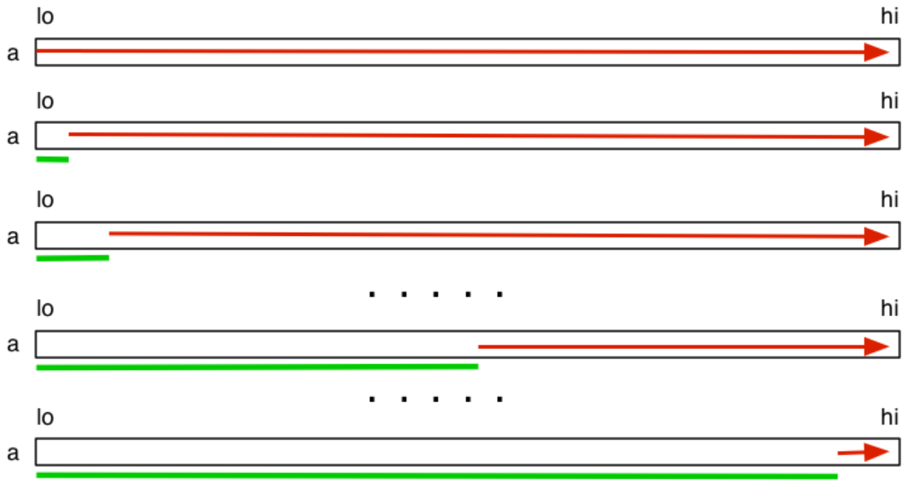

*Swap function:*

```c
void swap (int input[], int i, int j) {
    int tmp = input[j];
    input[j] = input[i];
    input[i] = tmp;
}
```

**Bubble sort:** 
*Logic:* looks at adjacent items and swaps if out of order, bubbling the item up
When the element being bubbled encounters an element it should swap with, that other element becomes the one being bubbled. Doing this `n` times across the whole array results in a sorted array

- Grows from left to right, with the max item encountered being bubbled to the far right
- Can be stable and adaptive, because it can check if the array is already sorted

```c
// Sorts to ascending order
void bubbleSort(int input[], int lo, int hi) {
    for (int i = lo; i < hi; i++) {
				int swaps = 0;
		        for (int j = hi - 1; j > i; j--) {
		            if (input[j] < input[j - 1]) {
		                swap(input, j, j - 1);
										swaps++;
		            }
		        }
			  if (swaps == 0) break;  // Since the array was scanned and no swaps were made, the array must be sorted, so break
    }
}
```

*Time-complexity:* O(n²) 
Best case: the array is already sorted, so just 1 + 1 + ... + 1 comparisons (n)
Worst case: the array is reverse sorted, so (n-1) + (n-2) + ... + 1 = 

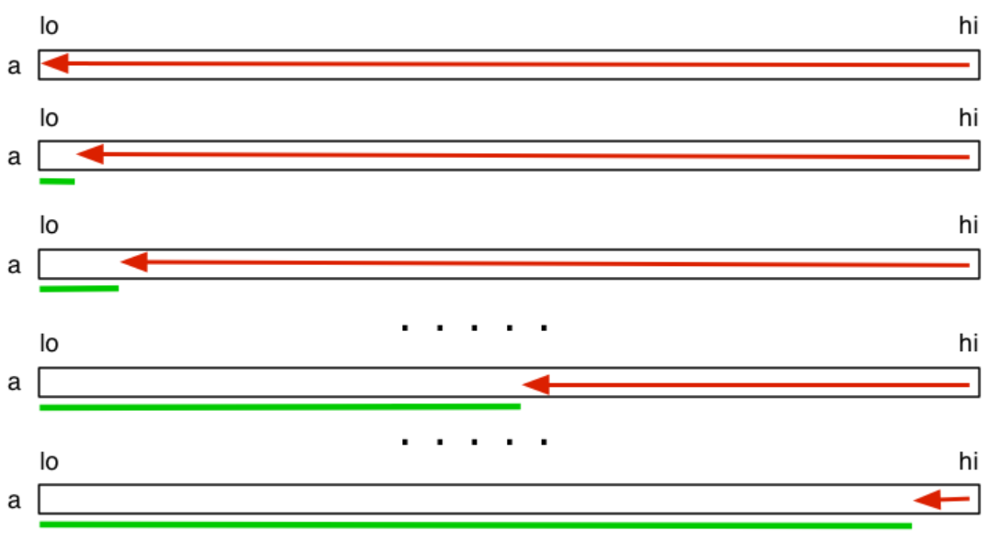

**Insertion sort:**
*Logic:* on each iteration, consider the element right next to the sorted segment. Bubble that element to the right place within the sorted array by comparing with elements in the already sorted segment.

- Grows from left to right, considering elements directly next to the end of the sorted array.
- Stability depends on implementation, adaptive if it stops scanning when the position is found

```c
// Sorts to ascending order
void insertionSort(int input[], int lo, int hi) {
    for (int i = lo; i < hi; i++) {
        for (int j = lo; j < i; j++) {
            if (input[i] < input[j]) {
                swap(input, i, j);  // Bubble it to the right place in the sorted segment
            }
        }
    }
}
```

*Time-complexity:* O(n²)
Best case: the array is already sorted, so we just have 1 + 1 + ... + 1 comparisons (n)
Worst case: the array is reverse sorted, so we have a growing number of comparisons to find where to insert the new element in the sorted segment (same as for selection sort: `n(n+1)/2`)

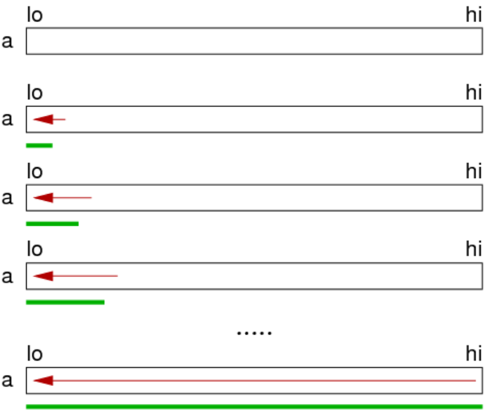

**Shell sort:**
Also known as *h-sorting,* which is an improvement on insertion sort.
A 3-sorted array means that if we take elements `array[0]`, `array[3]`, `array[6]`, ..., they will be in order.
A 2-sorted array means that if we take elements `array[0]`, `array[2]`, `array[4]`, ..., they will be in order.
A 1-sorted array means that the array is sorted
Algorithm uses a characteristic sequence of *h-values*. Such sequences are determined empirically, for example 1093, 364, 121, 40, 13, 4, 1, or something else

```c
// Sorts to ascending order
void shellSort(int a[], int lo, int hi) {
		int hValues[8] = {701, 301, 132, 57, 23, 10, 4, 1}
		for (int i = 0; i < 8; i++) {
				int h = hValues[i];
				int start = h + lo;
				for (int n = start; n < hi, n++) {
						int value = a[n];
						for (int k = n; k >= start && value < a[k - h]; k -= h) {
								move(a, k, k - h);
						}
						a[k] = value;
				}
		}
}
```

Efficiency depends on the h-values used, which we can achieve O(n^(3/2)) with, or even better with the right sequence.  Shell sort has not yet been fully analysed.

**Quick sort (recursive):**

*Logic:* pick a pivot element, then sort the array such that everything to the left of that pivot is less than it while everything to the right is greater than it, and then start sorting left and right by the same function.

- Usually not stable and not adaptive

```c
// Sorts to ascending order
void quickSort(int input[], int lo, int hi) {
		if (lo >= hi) return;              // Terminating case
		int i = partition(input, lo, hi);  // Partition returns the index of where the pivot element input[lo] belongs 
		quickSort(input, lo, i - 1);       // Sort the unsorted left segment
		quickSort(input, i + 1, hi);       // Sort the unsorted right segment
}
```

In the partition function, we are finding the right spot to place the pivot element and swapping elements from left and right segments so that everything to the left of the pivot is less than it and everything to the right is greater than it
1. Scan from the left, if the pivot encounters something greater than it, stop
2. Scan from right, if the pivot encounters something less than it, stop
3. Swap the elements which caused scanning to stop
4. Continue the scanning from left, then scanning from right and swapping. 
5. Stop when the left and right scanners cross each other
6. Swap the pivot element with where this intersection occurred

```c
// Sorts to ascending order
int partition(int input[], int lo, int hi) {
    int pivotIndex = lo;  // Choose the first element to be pivot element. We could make smarter choices 
    int i = lo + 1;       // Left scanner
    int j = hi;           // Right scanner
    while (1) {
        while (input[i] < input[pivotIndex] && i < j) {  // Pause when an item in the left segment was found to be larger than the pivot value 
            i++;  
        }
        while (input[j] > input[pivotIndex] && i < j) {  // Pause when an item in the right segment was found to be smaller than the pivot value
            j--;
        }
        if (i == j) break;          // Stop once i and j cross over
        else swap(input, i, j);     // Swap and then resume scanning from where we left off
    }
    j = (input[i] < input[pivotIndex]) ? i : i - 1;  // If where element at where i stopped is smaller than the pivot value, set j to i, otherwise set it to i - 1 
    swap(input, pivotIndex, j);  // Swap the pivot element at input[lo] to where it should be -- at index j where the left scanner and right scanner intersected
    return j;  // The pivot is now at j, where it belongs
}
```

*Time-Complexity:* O(n²) — but the average case is usually better
Best case: the choice of pivot leads to equal partitions for each recursive step, so there will be log(n) levels, each level requiring n comparisons, hence O(nlogn)
Worst case: the choice of pivot leads to paritions of sizes 1 and (n-1) for each recursive step, so there will be n levels, requiring n comparisons, hence O(n²)
Eg. for sorted arrays, we will make n recursive calls, forming 1 and n-1 partitions

*Partitioning steps:* 

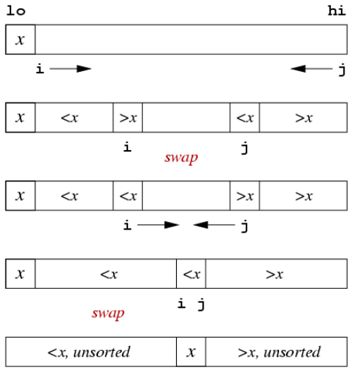

**Improving partition:**

- Could select the pivot in other ways instead of taking the first element every recursive step
- Parititioning is inefficient when dealing with small partitions. We could solve small partitions differently by, for example, switching to insertion sort.
- If the array contains duplicates of the pivot value, we could 3 partitions with the middle one containing duplicates of pivot.

*Quicksort can be implemented iteratively using a stack:*

```c
void quickSort(int input[], int lo, int hi) {
		Stack s = newStack();
		StackPush(s, hi);
		StackPush(s, lo);
		while (StackSize(s) > 0) {
				int low = StackPop(s);
				int high = StackPop(s);
				if (high > low) {
						int i = partition(input, lo, hi);
						StackPush(s, hi);
						StackPush(s, i + 1);
						StackPush(s, i - 1);
						StackPush(s, lo);
				}
		}
}
```

**Merge sort (recursive):**
*Logic:* ****split the array into two equal partitions, sort each partition, then merge it into a final sorted array. 

```c
// Sorts to ascending order
void mergeSort(int input[], int lo, int hi) {
    if (lo >= hi) return;
    int mid = (lo + hi) / 2;
    mergeSort(input, lo, mid);
    mergeSort(input, mid + 1, hi);
    merge(input, lo, mid, hi);
}

void merge(int a[], int lo, int mid, int hi) {
   int i = lo;
   int j = mid + 1;
   int k = 0;   // Indexer for temporary array
   int tmp[hi - lo + 1];  // Temporary array to store sorted values
   
   while (i <= mid && j <= hi) {  // Scan through both segments, choosing the one that's less than the other
     if (a[i] < a[j])
        tmp[k++] = a[i++];        // Move the index of the left segment along
     else
        tmp[k++] = a[j++];        // Move the index of the right segment along
   }
   
   // One of the segments will still have elements that need to be copied over
   while (i <= mid) tmp[k++] = a[i++];
   while (j <= hi) tmp[k++] = a[j++];

   // Copy the sorted dummy array into the main array
   for (i = lo, k = 0; i <= hi; i++, k++)
      a[i] = tmp[k];
}
```

*Time-complexity*: O(nlogn)
Best case: each level requires less than n comparisons when merging — O(nlogn)
Worst case: each level requires comparisons made all the way until the end of partitions — O(nlogn)

*Space-complexity:* O(N)

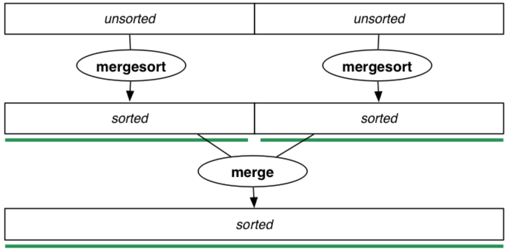

*Mergesort can be implemented non-recursively, without a stack.*  
**Bottom-up Mergesort (iterative):**

```c
void mergeSort(int a[], int lo, int hi) {
		int end;
		for (int m = 1; m <= lo - hi; m = m * 2) {  // Run lengths are: 1, 2, 4, ... until the run length is greater than the array size
				for (int i = lo; i <= hi - m; i += 2 * m) {
						end = min(1 + 2 * m - 1, hi);  // End is the endpoint of the two segments (runs). Select end = hi, so we don't run over the array size
						merge(a, i, i + m - 1, end);   // i + m - 1 is the midpoint of the start of the first segment and end of the second
				}
		} 
}
```

---

Sorting lower bound of performance: any comparison-based sorting algorithm *must take at least Ω(nlogn) time* to sort n elements.
*Proof.* Suppose that we have a sequence of n unique values. There are n! permutations, where one sequence is ordered.  For a binary decision tree, the height is at least log2(n!), so the number of comparisons required is log2(n!), which using inequalities, can be proven to be greater than nlogn. Hence Ω(nlogn) is the lower bound for all comparison based sorting algorithms.

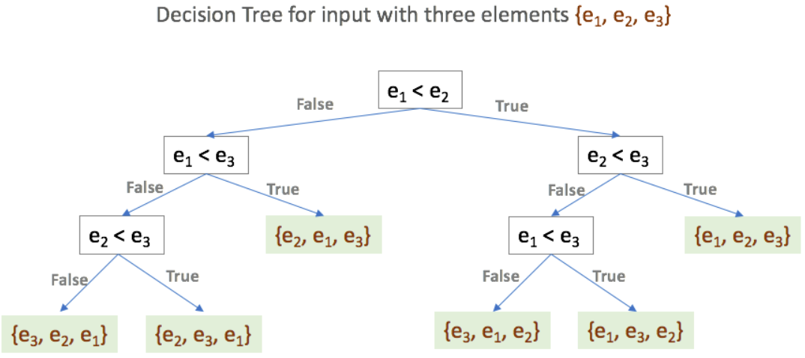

---

### Non-Comparison based sorting

**Radix Sort:**
*Logic:* sort the array by the last digit, then by the next and so on until the largest radix is sorted. At this point, the array is sorted. This works only if the implementation is stable

*Time-complexity:* O(mn) — where m is the number of radix points. This generally outperforms comparison based sorting algorithms when n → ∞

# Week 9: Text Processing Algorithms

**Notes:**

- Alphabet Σ — defines the *set of characters* usable in strings
Empty string λ — string of length 0, ""
- Brute-force pattern matching involves comparing a substring to a chunk of the main text and only moving the chunk along by 1 after each iteration.
- Boyer-Moore's and Knuth-Morris-Pratt's pattern matching algorithms are like the brute force algorithm but they can compute a smarter jump length for each iteration
- Boyer-Moore works well for texts with large alphabets with a reasonable distribution of different characters.
Knuth-Morris-Pratt works well for texts with smaller alphabets (eg. DNA sequences).
Both algorithms aim to shift the text substring forward more intelligently than the brute-force approach

### Boyer-Moore Algorithm:

*Logic:* compare the last character of the pattern to the corresponding character in the text. If mismatch, then check if that mismatching character from the text appears in the pattern. If it does, then jump forward a calculated amount. If it doesn't then jump by `strlen(pattern)` characters.

The Boyer-Moore algorithm requires some preprocessing using the *last occurrence function:*  **L : Σ → {0, 1, ..., m}**

- Consider the string "acab"
L(a) = 2   → Although a also appears at index 0, we only want the last occurrence
L(b) = 3
L(c) = 1
L(d) = -1 → Setting to unused characters to -1 is important in computing the jump distance
... 
L(z) = -1
- L maps each letter of the alphabet to the index where the character last occurred in the string. So when calculating the last occurrence index, it first has L(a) = 0 and then updates it to L(a) = 2 to record the last occurrence of a.
- *Time-complexity:* O(m+s) — where `m` is the length of the string and `s` is the cardinality of the alphabet

*Boyer-Moore algorithm:*

```c
int BoyerMooreMatch(char *text, char *pattern, char *alphabet) {
		int i = m - 1;  // Where m is the length of the pattern
		int j = m - 1;  
		while (i < n) {  // Where n is the length of the text
				if (text[i] == pattern[j]) {
						if (j == 0) {
								return i;  // The pattern survived all character matches, so return the index of the main text where the pattern was found
						} else {
								i--;  // Decrement to match the next pair of characters
								j--;
						}
				} else {
						i += m - min(j, 1 + L(text[i]));  // If the last occurrence of text[i] is AFTER j, then jump (m - j) characters. Else, if the last occurrence of text[i] is before j, then jump (m - (1 + L(text[i]))) -- This aligns the character in 'pattern' with text[i]
						j = m - 1;
				}
		} 
		return NO_RESULTS;
}
```

*Time-complexity:* O(nm + s)
Worst case: finding pattern "baaa" in "aaaaaaaa...aaa"

**Case 1:**
`text[i]` does not occur in the pattern string (so `L(text[i])` is -1). Jump `m - (1 + L(text[i]))`, which is the biggest jump possible — `m` characters

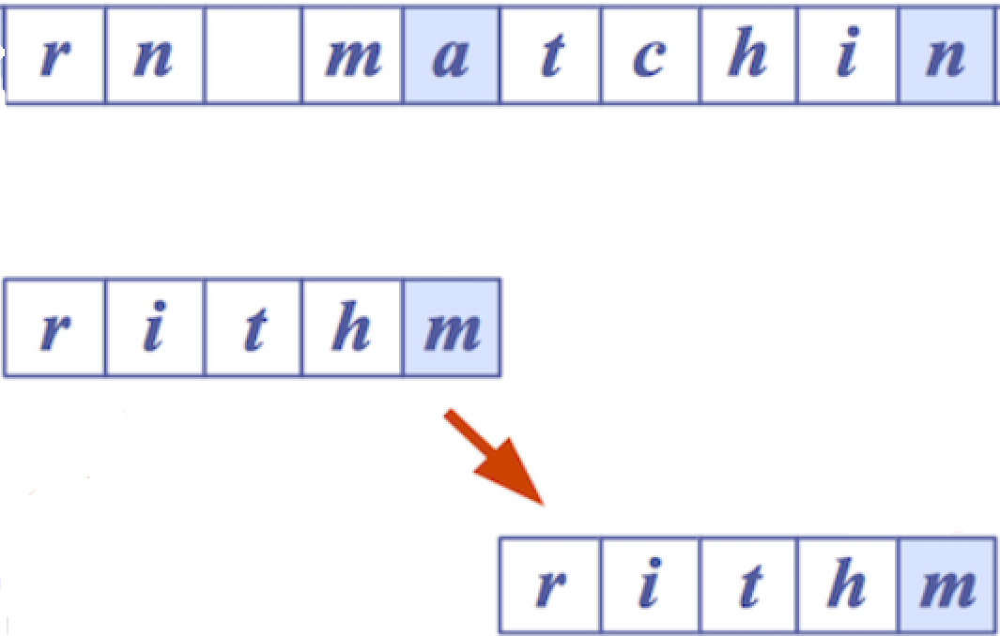

**Case 2:** 
`text[i]`'s last occurrence in pattern is *after* *`j`*, so jump `m - j` characters

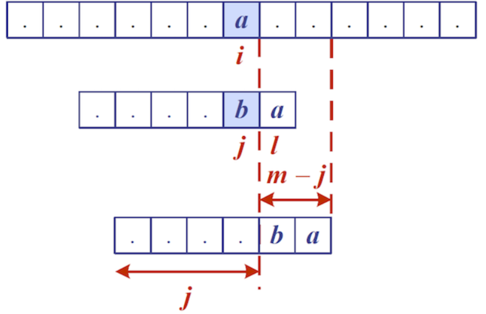

**Case 3:** 
`text[i]`'s last occurrence in pattern is *before* `j`, so jump `m - (1 + L(text[i]))` characters
The mismatched `text[i]` is aligned with the same character found before `j` in the pattern

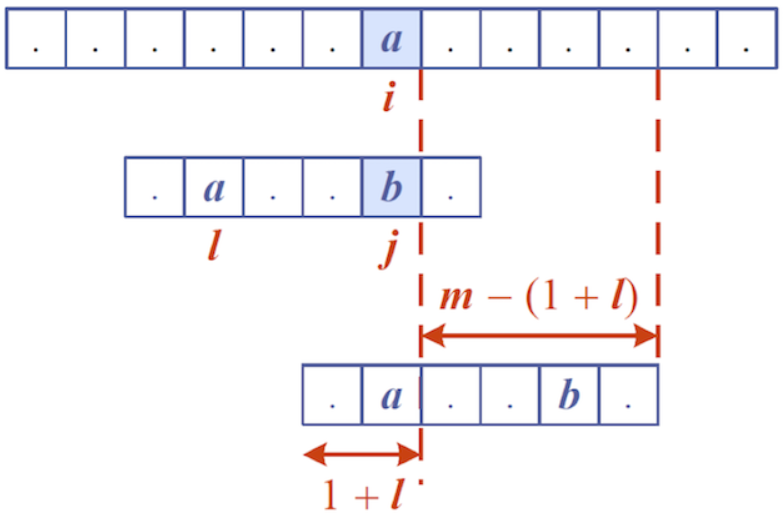

### Knuth-Morris-Pratt Algorithm:

**Failure function:** 
KMP also requires preprocessing on the pattern to find if prefixes occur in the rest of the pattern.

For each index `j`, find the longest prefix from 0 to `j` that matches the suffix in [1, j], up to and including index j, then record the function value as the number of characters in the prefix.

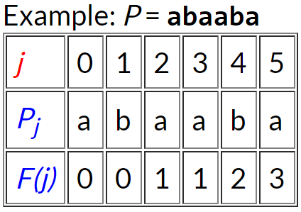

For j = 0: "a"           — no prefix matches suffix — record F(0) = 0
For j = 1: "ab"         — no prefix matches suffix — record F(1) = 0
For j = 2: "aba"       — "a" works                        — record F(2) = 1
For j = 3: "abaa"     — "a" works                        — record F(3) = 1
For j = 4: "abaab"   — "ab" works                      — record F(4) = 2
For j = 5: "abaaba" — "aba" works                    — record F(5) = 3

*Time-complexity:* O(m)

*Knuth-Morris-Pratt algorithm:*
KMP scans from left to right, unlike Boyer-Moore.

```c
int KMPMatch(char *text, char *pattern) {
		int i = 0;  // Start scans from left to right
		int j = 0;
		int F[m];
		failure(F, m);  // Fill up array F with function values
		while (i < n)) {  // Where n = strlen(text)
				if (text[i] == pattern[j]) {
						if (j == m - 1) {
								return (i - j);  // Pattern found, return the index at the start of the successful match
						} else {
								i++;
								j++;
						}
				} else {  
						if (j > 0) {
								j = F[j - 1];  // On failure, resume comparing the pattern starting from F(j - 1)
						} else { 
								i++;
						}
				}
		}
		return NO_MATCHES
}
```

*Time-complexity:* O(m + n) — O(m) for the failure function preprocessing and O(n) for scanning through the whole text

On mismatch, reset `j` to `F(j - 1)` if `j > 0` and continue scanning. If `j == 0`, then just increment `i` and continue scanning


### Tries:

A *trie* is a tree which holds a *set of strings*, like all the words in a text or a dictionary, and handles two main operations: `search()` and `insert()`. Trie's name comes from re*trie*val. 

Boyer-Moore and Knuth-Morris-Pratt's algorithms preprocessed their *pattern* string. If the text is large, immutable and searched for often, like *Hamlet*, then we can preprocess the *main* text instead, allowing for quick pattern queries using the trie data structure.

The depth of a tree is equal to the longest string length. 

Each node:

- Contains just one character
- Has 0-26 children
- May be marked as a terminating node (but can still have children) to identify that the node is the end of a complete recorded word
- Terminating nodes may also hold the line numbers/index of the word's occurrences in the text as a struct field

The number of words stored = the number of terminating nodes

*Possible struct declaration:*

```c
#define ALPHABET_SIZE 26
typedef struct trieNode *Trie;
struct trieNode {
		bool isLastChar;  // If this is true, then a complete word has been formed when this node is reached
		char character;   // Current node's character
		Trie *children;   // An array of size ALPHABET_SIZE    
};

// Returns a pointer to the node where the target string was found
Trie findInTrie(Trie trie, char *target) {
		char *ch;
		Trie curr = trie;
		for (ch = target; ch != '\0'; ch++) {		
				if (curr -> children[ch]) {
						curr = curr -> children[ch];  // Move down the trie, following the target string's characters
				} else {
						return NULL;  // Character node doesn't exist
				}
		}
		if (curr -> isLastNode == true) {
				return curr;
		} else {
				return NULL;  // Character was found, but it wasn't marked as a finishing node. So the word wasn't actually recorded
		}
}

// Not sure if this works... 
Trie insert(Trie trie, char *newWord, int length) {
		Trie t;
		if (trie == NULL) {
				t = malloc(sizeof(struct trieNode));
				t -> character = newWord[0];
		}
		if (m == 0) {
				t -> finish = true;
				t -> data = newWord;
		} else {
				t -> children[newWord[1]] = insert(trie, &newWord[1], length - 1);  // Pass a string one character shorter to the next insert() call
		}
		return t;		
}
```

*Time-complexity:* O(sm) — where m is strlen(target string) and s is the size of the alphabet. The time-complexity is independent of how many actual entries there are in the tree.
*Space-complexity:* O(n) — size of text (eg. total number of characters in each word in a dictionary)

---

### Compressed Tries:

Compressing a trie involves **c**ollapsing linear branches into a single node:

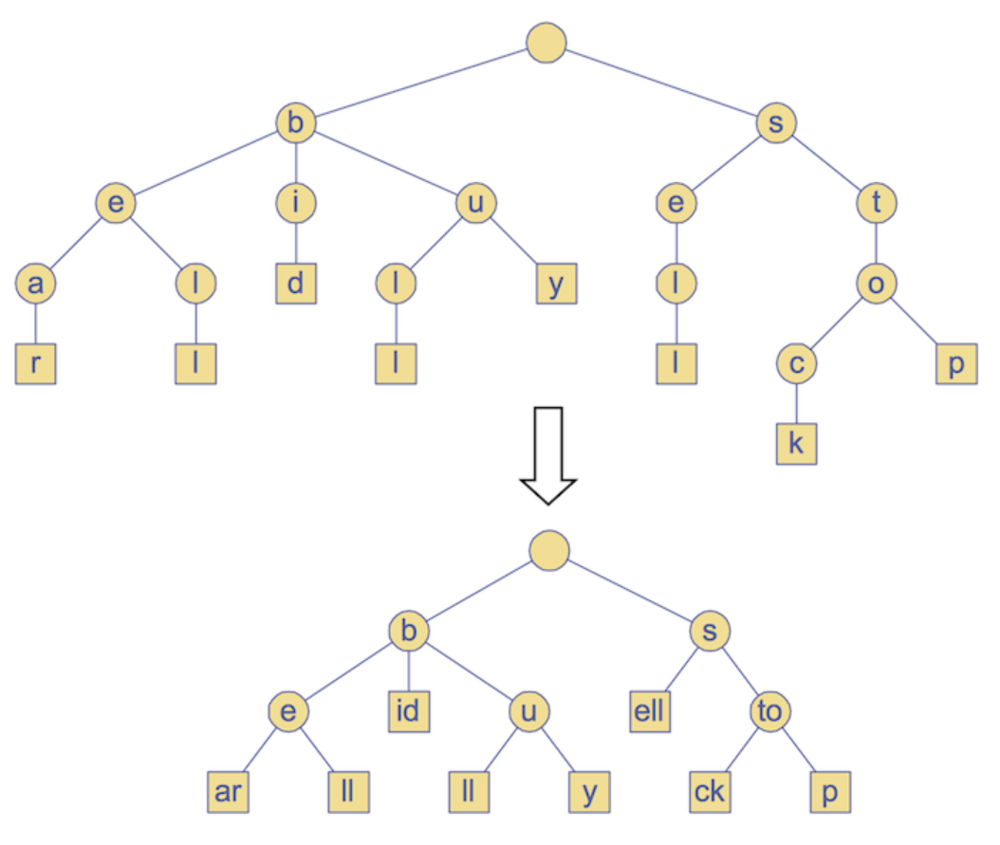

Using 3-tuples, (i, j, k), we can encode a slice of strings for collapsed linear branches. 
So (8, 2, 3) navigates to the 8th word and then takes the slice of S[8] from index 2 to 3

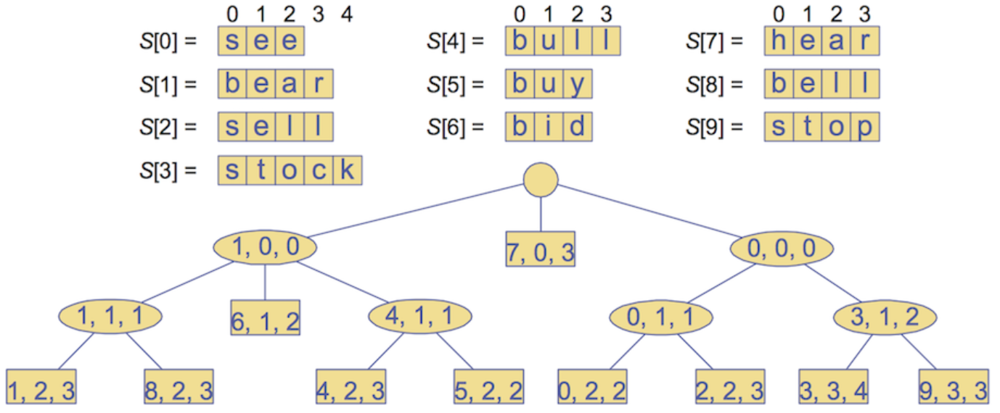

**Compressed Suffix Tries — For pattern matching:**

Insert all suffixes of a given word as separate entries into a trie and then compress it.

For example, for "minimize":
Insert all suffixes: "e", "ze", "ize", ..., "minimize" into a regular trie, then compress.

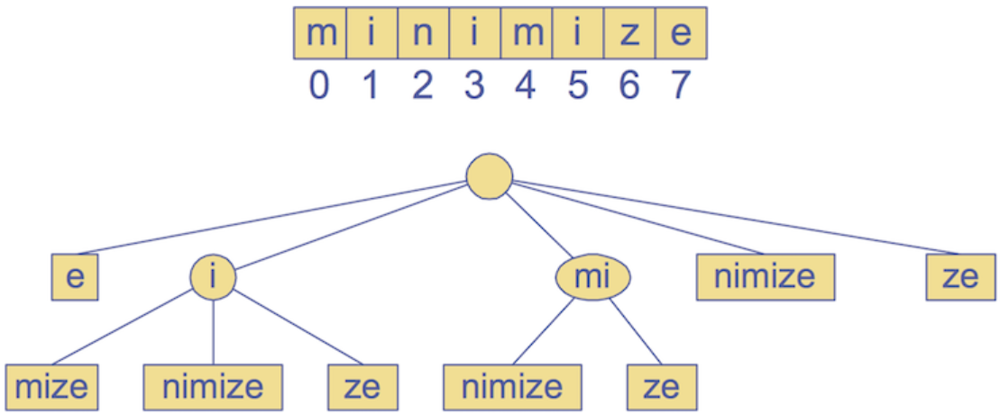

2-tuples representing slices of the text, "minimize"

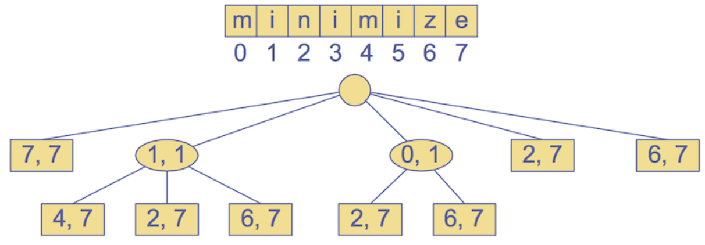

*For constructing the suffice tree:*
*Time-complexity*: O(n) — 
*Space-complexity*: O(n) — 

Pattern matching:
*Time-complexity:* O(ms) — where m is the length of the pattern and s is the size of the alphabet

### **Text Compression — Huffman's Algorithm:**

Text compression revolves around the problem: *"can we efficiently encode a string X with a smaller string Y?"*

Lossy compression: a class of *irreversible* data compression methods using approximations and partial data discarding to represent the content, causing a loss of quality/resolution.

- For MP3, there are certain frequencies that aren't human detectable so we can remove the bits encoding those frequencies
- JPG is a lossy compression method for digital images. We can reduce the colour encoding size — meaning that for heavier compressions, the difference between colours is less fine because the colour encoding capability is made smaller since we've reduced the amount of bits available to encode each pixel's colour

**Huffman's algorithm:**
Huffman's algorithm provides a *lossless* text compression system. It defines bit-codes for characters such that each bit code is *not a prefix for any other bit code*, which is crucial for navigating the Huffman encoding tree.
Higher frequency characters are assigned shorter bit codes.

1. Go through entire text and calculate the frequency of every character
2.  Build the encoding tree:
→ Initially have single nodes representing each character in the text
→ Merge the two lowest frequency characters into a single cluster
→ Repeat the process until a full tree is created

    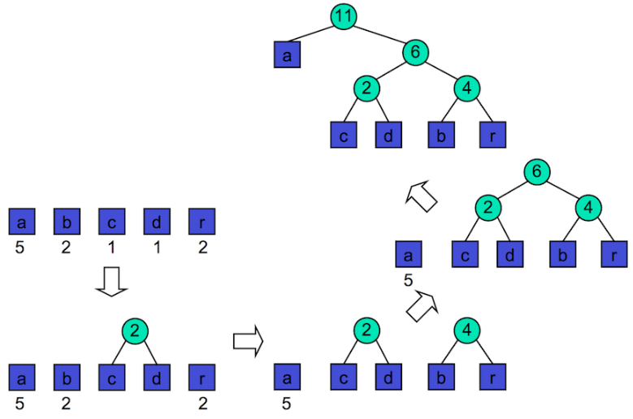

The path to a leaf node corresponds to a bit-code

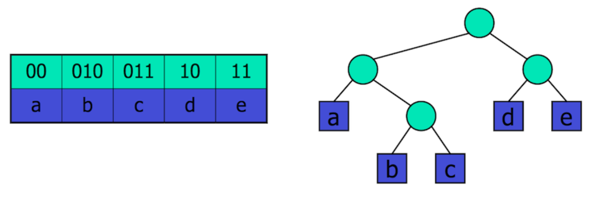

```c
Tree createTree(char *text) {
		int frequencies[ALPHABET_SIZE];
		computeFrequencies(frequencies, text); 
		PQueue pqueue = newPQueue();
		for (char c = 'a'; c <= 'z'; c++) {
				if (frequencies[c] != 0) {
						Tree t = malloc(sizeof(struct treeNode));
						t -> freq = frequencies[c];
						t -> left = NULL;
						t -> right = NULL;
						PQueueJoin(queue, t);
				}
		}
		while (QueueSize(queue) >= 2) {
				t1 = PQueueLeave(queue);  // t1 has highest priority (frequency)
				t2 = PQueueLeave(queue);  // t2 has next highest priority
				freq1 = t1 -> freq;
				freq2 = t2 -> freq;
				Tree t = malloc(sizeof(struct treeNode));  // Create a new tree which has t1 and t2 as subtrees and contains the sum of both their frequencies
				t -> freq = freq1 + freq2;
				t -> left = t1;
				t -> right = t2;
				PQJoin(queue, t);  // Join this tree into the queue of nodes to join
		}
		return PQLeave(queue);  // There should be last element left in the queue, which is the root node of a completed encoding tree
}
```

*Time-complexity:* O(n + slogs) — for computing frequencies, creating nodes for each occurring character and building the encoding tree, where s is number of unique characters

---

## C Extras:

- **Switch-case statements:**
A nicer alternative to a series of *else if* statements

    ```c
    switch (expression) { // The expression is evaluated and compared with each case{
        case constant1:   // This block is executed if expression resolves to constant1
          // statements
          break;          // Breaks out of the curly brackets
        case constant2:
          // statements
          break;
        ...
        default:          // Optional. This block is executed when no cases were matched
          // default statements
    }
    ```

- **Ternary conditional operators:** 
Resolves to one value if the condition is true, or resolves to another if the condition is false:

    ```c
    int x = 1, y;
    y = (x == 1 ? 0 : 1);  // Assigns y to be 0, since x == 1 is true. Syntax: y = (condition ? trueValue : falseValue)
    ```

### Compilation and Makefiles:

The separation between .h and .c files is crucial and will be used extensively in implementing abstract data types

- Compilers are *programs* that convert source code to executable machine code
gcc — Gnu C compiler, a multi-purpose tool that compiles (-c), links and produces executables (-o)
- **Compilation steps:**
1. Preprocessing phase — for preprocessor directives like #define, the compiler replaces all macros with their associated value
2. Compiles source code to produce *object files* 
3. Object files and libraries are linked to produce the final executable file

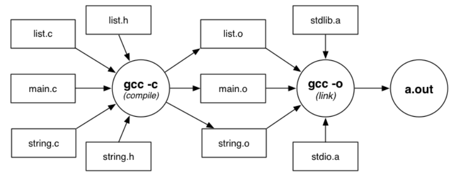

```bash
gcc -c Stack.c                # Produces Stack.o from Stack.c and Stack.h
gcc -c bracket.c              # Produces bracket.o from bracket.c and bracket.h
gcc -o rbt bracket.o Stack.o  # Links bracket.o, Stack.o and libraries and produce the executable named 'rbt'
															# If the executable name isn't specified then by default the name is a.out 
															# The libraries are included implicitly
```

- **Include directive:**
The #include preprocessor directive is used to paste code into the current flower.
`#include <stdio.h>` — the `<>` tells the compiler to search for header files in the System Libraries
`#include "myfile.h"`  — the `""` tells the compiler to search for header files in the current directory
Header files vs .c file is like the interface vs. implementation
- `#include` preprocessor directive is used to paste code of given file into current file.
- **For example #include <stdio.h>** : These directives tell the c processor to get stdio.h from System Libraries and add the text to the current source file.

**Makefile:**
Allows us to see *dependencies* in our code and conveniently compile using the `make` command

```bash
target : source1 source2 …  
        commands to build target from sources

# Example:
game : main.o graphics.o world.o # These sourcese are dependencies
				gcc -o game main.o graphics.o world.o
```

### Function Pointers:

Function pointers are the memory address of functions.
Function pointer declaration: `int (*fp) (int)` —   fp points to a function that returns an int and has one argument of type int

```c
int square(int x) { 
		return x * x;
}
int timesTwo(int x) {
		return x * 2;
}

int (*funcPointer) (int);
fp = &square;       // fp points to the square function
int n = (*fp)(10);  // calls square(10)
fp = timesTwo;      // & is optional, fp now points to timesTwo
n = (*fp)(2);       // calls timesTwo(2)
n = fp(2);          // (*...) is optional, normal function call
```

*Higher-order functions:* functions that has function pointers as arguments or returns function pointers

```c
void traverse (List head, void (*fp) (List)) {
		List curr = head;
		while (curr != NULL) {
				fp(curr);  // Applies the given function to curr! Traverse can apply any to all nodes any function with the signature void *funcName (List) 
				curr = curr -> next;
		}
} 
```

```c
void printName (List head);
void printZID (List head);
...
traverse(studentList, printName);   // Where printName fills the parameter: void (*fp) (List)
traverse(studentList, printZID);    // Where printZID fills the parameter: void (*fp) (List)
```

### Generic Types:

**Polymorphism:** ability of the same code to operate on different data types

- **Parametric polymorphism:** generic function parameters — a function argument that can accept multiple data types
- **Subtype polymorphism:** associated with inheritance hierarchies

void * pointers allow generic data types. By declaring values of type void *, we could pass those values into functions which *downcast* the void pointers to the correct type before operating on them. In object-oriented programming, *downcasting* or type refinement is the act of casting a reference of a base class to one of its derived classes.

---
